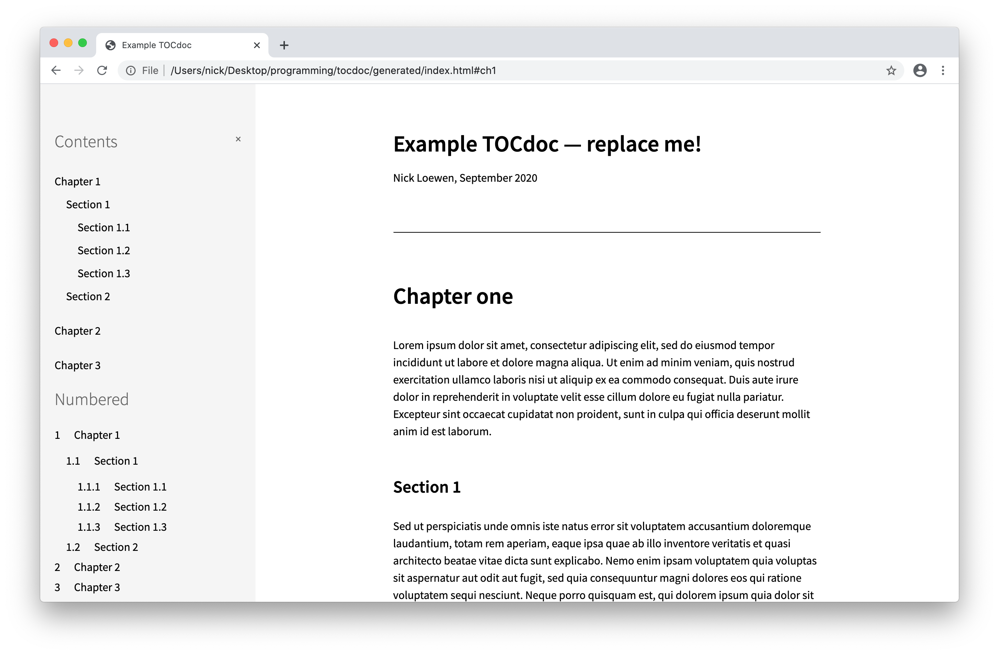

# TOCdoc

Make your long documents easy to read by adding a table of contents on the side. A lo-fi Gitbook alternative, using Pandoc and bash.

Create three files, run `./tocdoc.sh`, and open up `/generated/index.html` to see your TOCdoc:

Check out the [live example](https://nickloewen.github.io/tocdoc/), based on the default example document in [`document`](https://github.com/nickloewen/tocdoc/tree/master/document).

## Alternatives

TOCdoc is based on tools like:

* [Gitbook](http://gitbook.com) (a fremium service)
* [HonKit](http://github.com/honkit/honkit) (a fork of the old gitbook-cli)
* [mdBook](https://github.com/rust-lang/mdBook) (runs on Rust)
* [Bookdown](https://bookdown.org) (R Markdown)
* [docsify](https://docsify.js.org/) (client-side markdown rendering)

TOCdoc does less. But it also requires less configuration.

## Setup

First, [install Pandoc](https://pandoc.org/installing.html).

Then, `git clone https://github.com/nickloewen/tocdoc`.

Or, if you want to clone into a folder with a better name:

	$ mkdir philosophiae-naturalis-principia-mathematica
	$ cd philosophiae-naturalis-principia-mathematica
	$ git clone https://github.com/nickloewen/tocdoc .

## Creating a webpage

1. Create your document, and save it to `/document/body.md`.
2. Create your table of contents and save it to `/document/contents.md`
3. In `/documents/title.txt`, write the title you want displayed on the browser tab
4. Run `./tocdoc.sh`
5. Check out the output at `/generated/index.html`

For `body.md`, I recommend using an H1 for the overall page title, and H2s for chapter titles. A horizontal rule (markdown: `***`) between chapters is nice, too.

(The current stylesheet assumes that your first H1 will be followed by a byline, a horizontal rule, and the first chapter, with no additional content.)

For `contents.md`, use a regular markdown list. You can use an H2 to add a heading. (Other markdown will also work, it's just not covered by the stylesheet.)